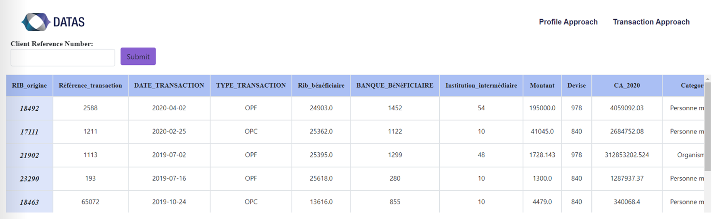

# Fraudulent-profile-prediction-model

this is the first approach of our solution, a machine learning model that can classify a customer into a risk level based on his activity and transaction history. 
This chapter describes the steps involved in building this model, from exploration, data processing, creating new features to adjusting the parameters to achieve the best performance.

The concretization of our model required the processing of the data, the resolution of the missing values problem, the coding and scaling of the variables so that they are understandable for our algorithms.
The next step was to generate new features with better predictive power. Next, we balanced our target classes by applying the SMOTE oversampling technique.
Then, our work focused on both model training, feature selection and parameter optimization to achieve the best model performance.
Comparing the results of the linear curves and the final cross-validation score, we found that the "Random Foret" model recorded the best score with the largest margin of improvement. However, the score for this model demonstrates the need for additional data mining to further improve our predictions.

Finally, the model was exported using the Joblib library and was deployed in our web application that we built using Djang.

